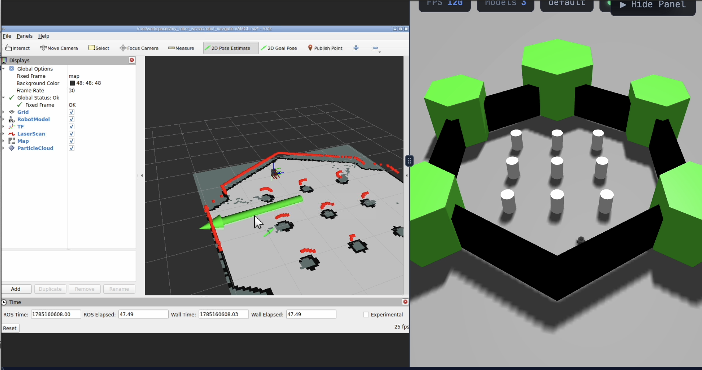
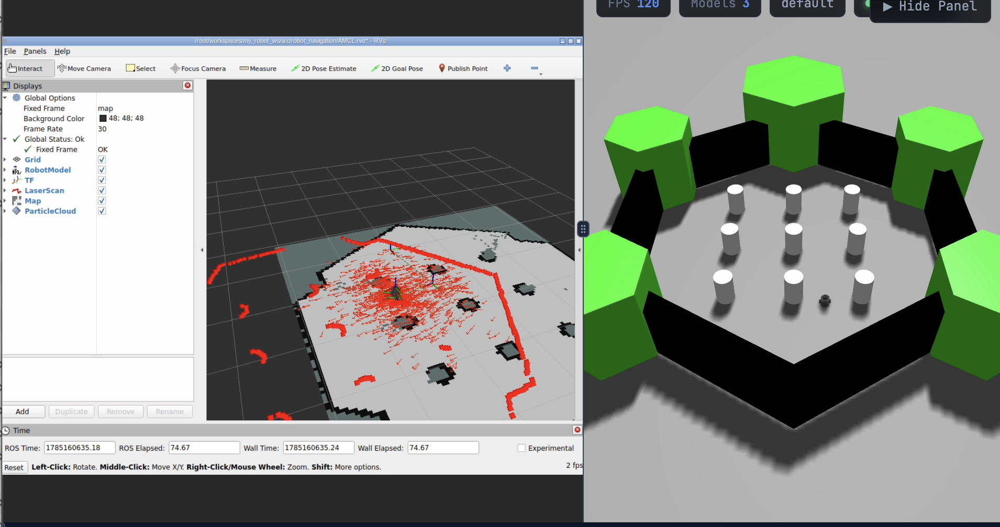
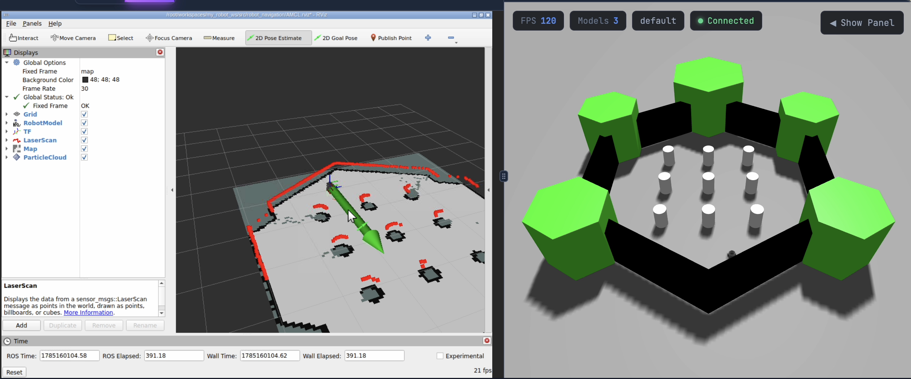
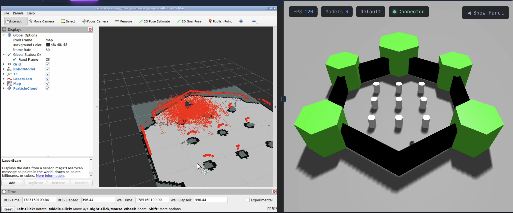
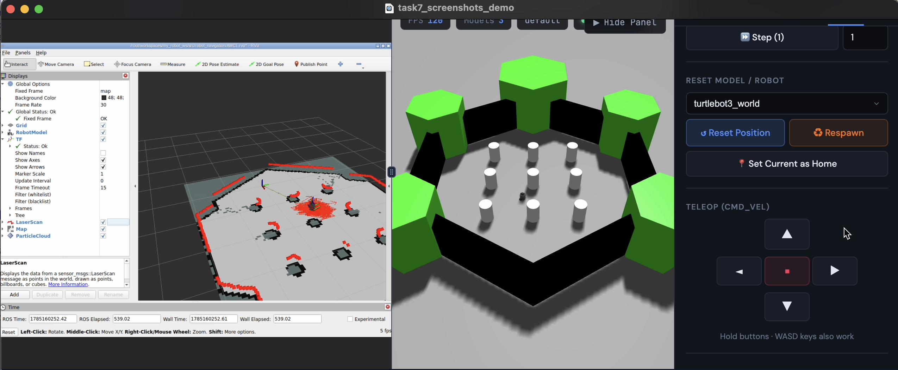
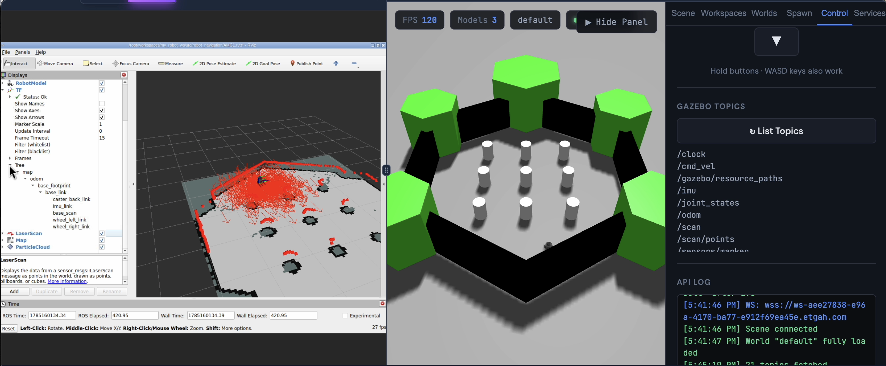

# AMCL 

Localize a TurtleBot3 inside a previously saved SLAM map using AMCL (Adaptive Monte Carlo Localization), built on ROS 2 and the Nav2 stack.

---

## 1. Project Overview

This project takes the map produced in a previous SLAM assignment and uses it to localize the robot with **AMCL**. The package (originally downloaded as `robot_navigation` and renamed to **`robot_localization`**) bundles the saved map, an AMCL parameter file, and a launch file that brings up `map_server`, `amcl`, and `nav2_lifecycle_manager` together so the robot can estimate its pose (x, y, yaw) inside the known map using LiDAR scan matching against odometry.

**Goals demonstrated in this run:**
- Load the saved map with `map_server` and confirm it renders correctly in RViz.
- Launch AMCL without errors, with `/scan` and `/odom` available.
- Visualize map, robot model, LiDAR scan, TF tree, and particle cloud in RViz.
- Give a deliberately wrong initial pose and observe the scan/map mismatch.
- Give the correct initial pose, drive robot around, and observe convergence.
- Drive the robot and confirm localization stays stable while moving.
- Confirm AMCL publishes the `map → odom` transform and that `/amcl_pose` updates continuously.

---

## 2. Package Structure

```
amcl-localization-[YOUR-NAME]/
└── robot_navigation/
    ├── config/
    │   └── amcl.yaml                  # AMCL parameters (initial pose, particle filter settings, etc.)
    ├── launch/
    │   └── amcl.launch.py             # Brings up map_server, amcl, and lifecycle_manager
    ├── map/
    │   ├── turtlebot3_world_map.yaml  # Map metadata (resolution, origin, image path)
    │   └── turtlebot3_world_map.pgm   # Occupancy grid image saved from the SLAM task
    ├── rviz/
    │   └── AMCL.rviz                  # Saved RViz display configuration
    ├── CMakeLists.txt
    └── package.xml
├── images/                            # Screenshots referenced in this README
└── README.md
```

**Notes:**
- `robot_navigation` only supplies configuration/map assets used by this launch file — it does not implement any nodes itself.
- The actual localization nodes (`map_server`, `amcl`, `lifecycle_manager`) come from the external **Nav2** packages (`nav2_map_server`, `nav2_amcl`, `nav2_lifecycle_manager`), which must be installed on the system (e.g. `sudo apt install ros-<distro>-navigation2`).

---

## 3. Build Instructions

1. Download the package and rename it from `robot_localization` to `robot_navigation`.
2. Copy it into the `src` folder of your workspace (`UR_workspace`):

```bash
cp -r robot_navigation ~/UR_workspace/src/
```

3. Build only this package and source the workspace:

```bash
cd ~/UR_workspace
colcon build --packages-select robot_navigation
source install/setup.bash
```

---

## 4. Commands Used to Launch the Simulator and AMCL

**Launch the Gazebo simulation** (TurtleBot3 world used for the original SLAM map):

```bash
ros2 launch turtlebot3_gazebo turtlebot3_world.launch.py
```
*(Alternatively, this can be started from the `turtlebot3_world.launch` entry inside the Gazebo interface.)*

**Launch AMCL** and load the map saved from the previous SLAM task (`turtlebot3_world_map.pgm` / `.yaml`):

```bash
ros2 launch robot_navigation amcl.launch.py
```

---

## 5. RViz Configuration

```bash
rviz2
```

Add the following displays and set **Fixed Frame = `map`**:

| Display | Topic | Extra settings |
|---|---|---|
| RobotModel | `/robot_description` | — |
| LaserScan | `/scan` | — |
| Map | `/map` | Durability Policy = **Transient Local** |
| TF | — | — |
| ParticleCloud | `/particle_cloud` | Reliability Policy = **Best Effort** |

> **Tip:** This full configuration is saved and can be loaded directly from `rviz/AMCL.rviz`.
>
> **Known issue:** If the map fails to load after applying this configuration, kill the AMCL launch terminal and re-run it.

**Setting the Initial Pose**

The initial pose can either be:
- Pre-defined inside `config/amcl.yaml`, or
- Set interactively from the RViz toolbar using **2D Pose Estimate**, clicking at the location and heading that matches the robot's actual pose in the Gazebo simulation.

---

## 6. Initial Pose — Screenshots and Observations

To test the effect of the initial pose estimate, **2D Pose Estimate** was used twice:

**Wrong initial pose**




*Observation:* The LiDAR scan does not align with the map walls, the particle cloud is scattered or concentrated in the wrong region, and `/amcl_pose` reports a position inconsistent with the robot's real location in Gazebo.

**Correct initial pose**





*Observation:* The LiDAR scan overlays cleanly onto the map's walls/obstacles, the particle cloud converges tightly around the robot after moving around, and `/amcl_pose` matches the robot's known position in Gazebo.

---

## 7. Particle Cloud Screenshot

*Shows the particle cloud converging around the robot's estimated pose as it moves and AMCL refines the estimate via scan matching.*


---

## 8. TF Tree Screenshot



*Shows the `map → odom → base_footprint → ... → base_scan` transform chain, with `map → odom` published by AMCL.*

---

## 9. Topic and Transform Outputs

**`/amcl_pose` — Location 1**

```bash
ros2 topic echo /amcl_pose --once
```

```
Type: geometry_msgs/msg/PoseWithCovarianceStamped
frame_id: map
pose:
  pose:
    position:
      x: -0.04898974279208736
      y: 0.07430547657434378
      z: 0.0
    orientation:
      x: 0.0
      y: 0.0
      z: -0.008103307511452438
      w: 0.9999671676647063

QoS profile:
  Reliability: RELIABLE
  History (Depth): UNKNOWN
  Durability: TRANSIENT_LOCAL
  Lifespan: Infinite
  Deadline: Infinite
  Liveliness: AUTOMATIC
  Liveliness lease duration: Infinite
```

**`/amcl_pose` — Location 2**

```bash
ros2 topic echo /amcl_pose --once
```

```
Type: geometry_msgs/msg/PoseWithCovarianceStamped
frame_id: map
pose:
  pose:
    position:
      x: 0.45942927157860564
      y: 0.8251585597334705
      z: 0.0
    orientation:
      x: 0.0
      y: 0.0
      z: -0.9547859807079049
      w: 0.29729401447665305

QoS profile:
  Reliability: RELIABLE
  History (Depth): UNKNOWN
  Durability: TRANSIENT_LOCAL
  Lifespan: Infinite
  Deadline: Infinite
  Liveliness: AUTOMATIC
  Liveliness lease duration: Infinite
```

**`map → odom` transform**

```bash
ros2 run tf2_ros tf2_echo map odom
```

```
At time 293.800000000
- Translation: [-0.016, -0.004, 0.000]
- Rotation: in Quaternion (xyzw) [0.000, 0.000, 0.007, 1.000]
- Rotation: in RPY (radian) [0.000, -0.000, 0.014]
- Rotation: in RPY (degree) [0.000, -0.000, 0.802]
- Matrix:
   1.000  -0.014   0.000  -0.016
   0.014   1.000   0.000  -0.004
   0.000   0.000   1.000   0.000
   0.000   0.000   0.000   1.000
```

This confirms AMCL is actively publishing the `map → odom` correction transform, and that `/amcl_pose` updates as the robot moves.

---

## 10. Demo Video

https://github.com/user-attachments/assets/2abe89d3-363f-43ac-b28a-2d7aa9ec7792

---

## 11. Common Problems and Solutions

| Problem | Solution |
|---|---|
| Map fails to load in RViz after configuring the Map display | Kill the AMCL launch terminal and re-launch `ros2 launch robot_navigation amcl.launch.py`. |
